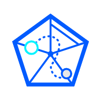

[](https://www.npmjs.com/package/islin)

一个多端、多版本、实时的前端代码覆盖率收集平台

[![NPM Version][npm-image]][npm-url]
[![NPM Downloads][downloads-image]][downloads-url]

```js
Islin.reportCoverage({
    dsn: 'http://xxx.xxx/api/v1/coverage/client',
    projectConfig: {
        projectName: 'projectName',
        commitSha: 'commitSha',
        projectId: 999,
        coverage: window.__coverage__
    },
    reporter:'reporter'
})
```

## ✨特性

- 🌈 支持多端，H5、小程序、RN。
- ⚙️ 支持多版本覆盖率收集。
- ⏰ 实时生成代码覆盖率报告。
- 📦 开箱即用，只需要配置项目的基本信息即可。

[comment]: <> (- ⛵️ 支持自托管 Islin。)

## 📦 快速开始

### 代码插桩
babel-plugin-istanbul安装
```bash
npm install --save-dev babel-plugin-istanbul
```

这段代码表示env为test时istanbul插件生效:

```json
{
  "env": {
    "test": {
      "plugins": [
        "istanbul"
      ]
    }
  }
}
```

具体请阅读 [babel-plugin-istanbul](https://github.com/istanbuljs/babel-plugin-istanbul) 文档

### 覆盖率上报

根据需要选择 islin 安装位置

```bash
npm install --save-dev islin
```

在UI自动化case编写上报代码
```js
// 需要在每个页面case结束时，获取当前页面的window.__coverage__对象，将覆盖率上报。
Islin.reportCoverage({
    dsn: 'http://xxx.xxx/api/v1/coverage/client',
    projectConfig: {
        projectName: 'projectName',
        commitSha: 'commitSha',
        projectId: 999,
        coverage: window.__coverage__,
    },
    reporter:'reporter',
})
```

亦可手工测试(提供 [islin-crx](https://chrome.google.com/webstore/detail/islin-crx/omnpafdjidgpdmlimbangcjjaaodbeof?hl=zh-CN&authuser=0) Chrome扩展)

[comment]: <> (## 自托管)

[comment]: <> (提供基于docker的islin自托管方案)

## License

[MIT](LICENSE)


[npm-image]: https://img.shields.io/npm/v/islin.svg

[npm-url]: https://www.npmjs.com/package/islin

[downloads-image]: https://img.shields.io/npm/dm/islin.svg

[downloads-url]: https://npmcharts.com/compare/islin?minimal=true